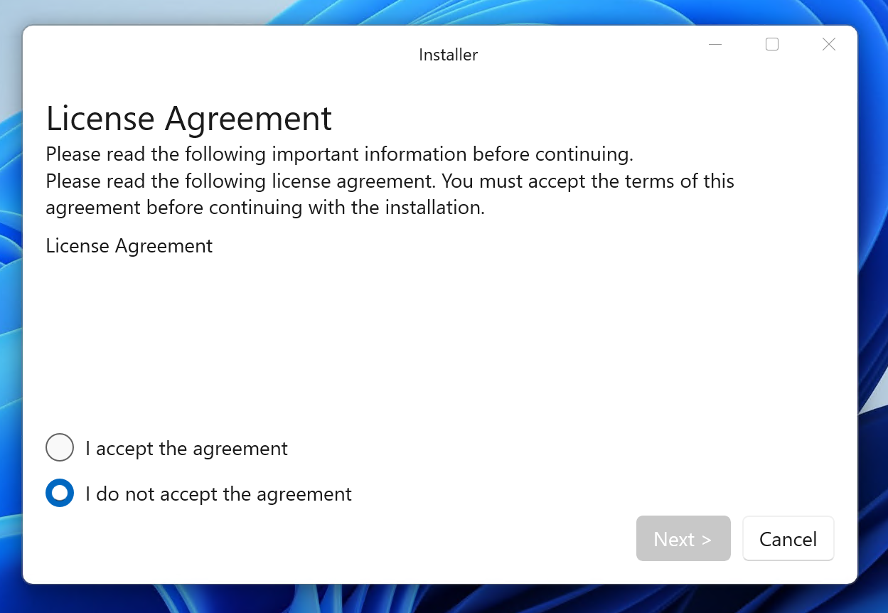

# PotableInstaller
PotableInstaller はアプリケーションソフトウェアをインストールするソフトウェアです。

PotableInstaller is the software that install the application software.

ポータブルインストーラーは [Releases](https://github.com/Himeyama/Installer/releases) からダウンロードできます。

PotableInstaller can be downloaded from [Releases](https://github.com/Himeyama/Installer/releases).
